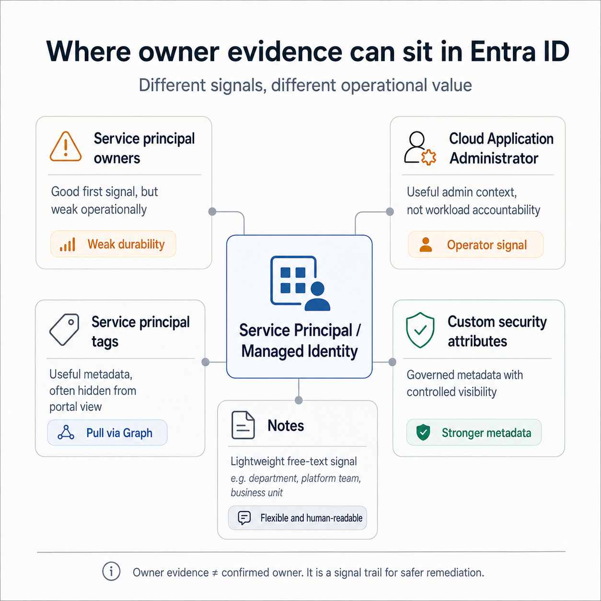
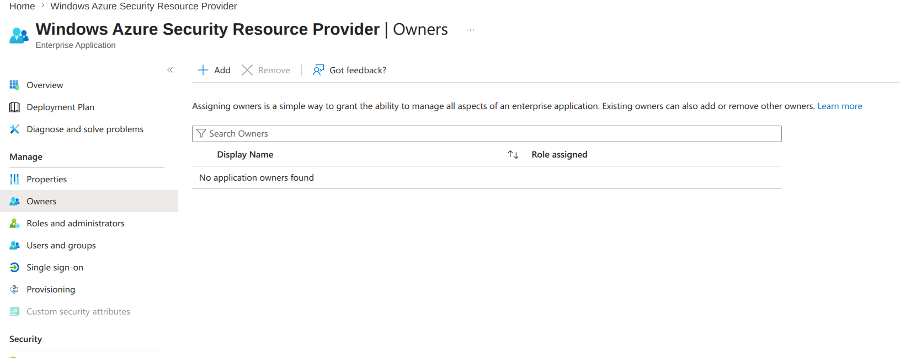
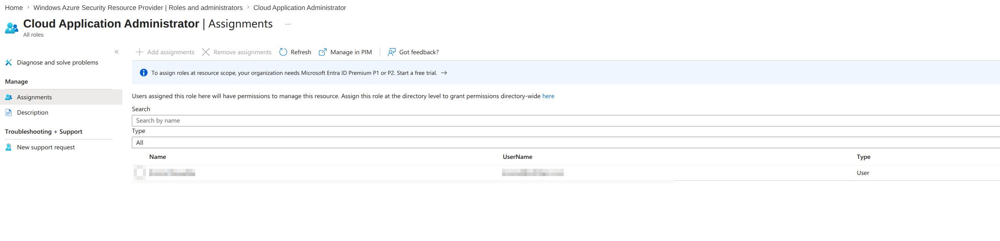

## Where owner evidence can sit in Entra ID



### Service principal: owners

Useful first signal, but weak as durable accountability evidence. Service principal owners can be users or other service principals, not ownership groups. A named user can leave, move teams, or lose context, so treat this as evidence, not final accountability.



### Service principal: Display name

Can carry useful hints such as project name, business application name, workload name, or environment. Treat it as weak evidence. Naming conventions drift and often reflect implementation history rather than current ownership.

### Service principal: Notes

Lightweight free-text signal. The `notes` field can carry human context such as owning department, platform team, business unit, support contact, or application purpose. Treat it as unstructured evidence, not an authoritative ownership model.


### Service principal: tags

Useful metadata signal. Tags can categorize or identify service principals and are easy to retrieve with Microsoft Graph PowerShell. Treat them as stronger than naming, but still verify freshness and convention quality.

```powershell
Get-MgServicePrincipal -ServicePrincipalId $spId -Property "id,displayName,tags" |
  Select-Object DisplayName, Id, @{n="Tags";e={$_.Tags -join ", "}}
```

### Custom security attributes

Stronger governance metadata than tags. Attribute visibility and assignment can be controlled through dedicated roles and Graph permissions. The attribute schema is defined up front, including type, single/multiple values, and whether values must come from a predefined list. This makes custom security attributes useful for structured ownership metadata, but they still need process discipline to avoid stale values.

Required for read scenarios:

* Entra role: Attribute Assignment Reader or Attribute Assignment Administrator
* Graph permissions: CustomSecAttributeAssignment.Read.All and Application.Read.All

```powershell
Get-MgServicePrincipal `
  -ConsistencyLevel eventual `
  -CountVariable CountVar `
  -Property "id,displayName,appId,servicePrincipalType,customSecurityAttributes" `
  -Filter "customSecurityAttributes/Ownership/cost_center ne null" |
Select-Object Id, DisplayName, AppId, ServicePrincipalType, CustomSecurityAttributes
```


### Cloud Application Administrator

Useful administrative context, but not ownership evidence by itself. This role can manage app registrations and enterprise applications, so it usually points to operators or platform administrators, not accountable workload owners.




### Service principal: creation or modification

Creation/modification points to an operator or administrator, not necessarily the accountable owner.
